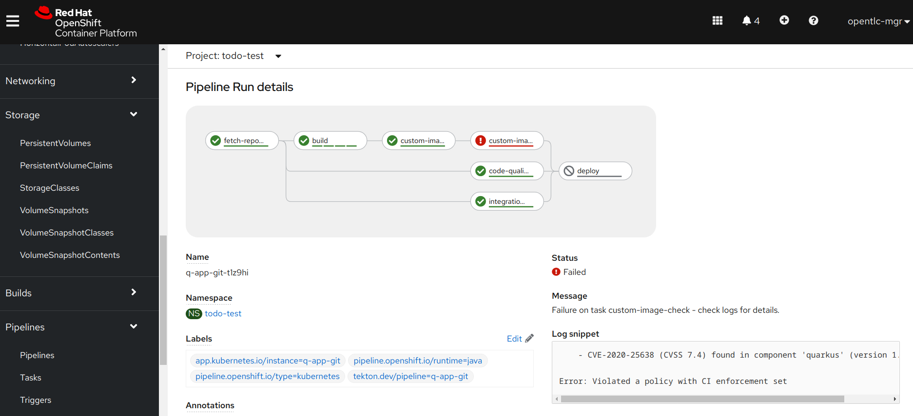
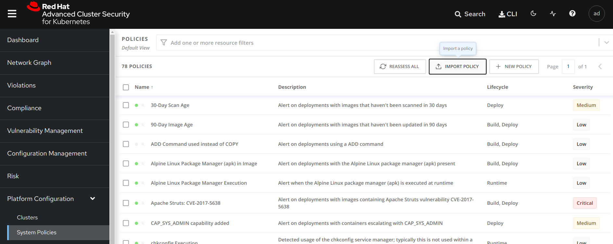
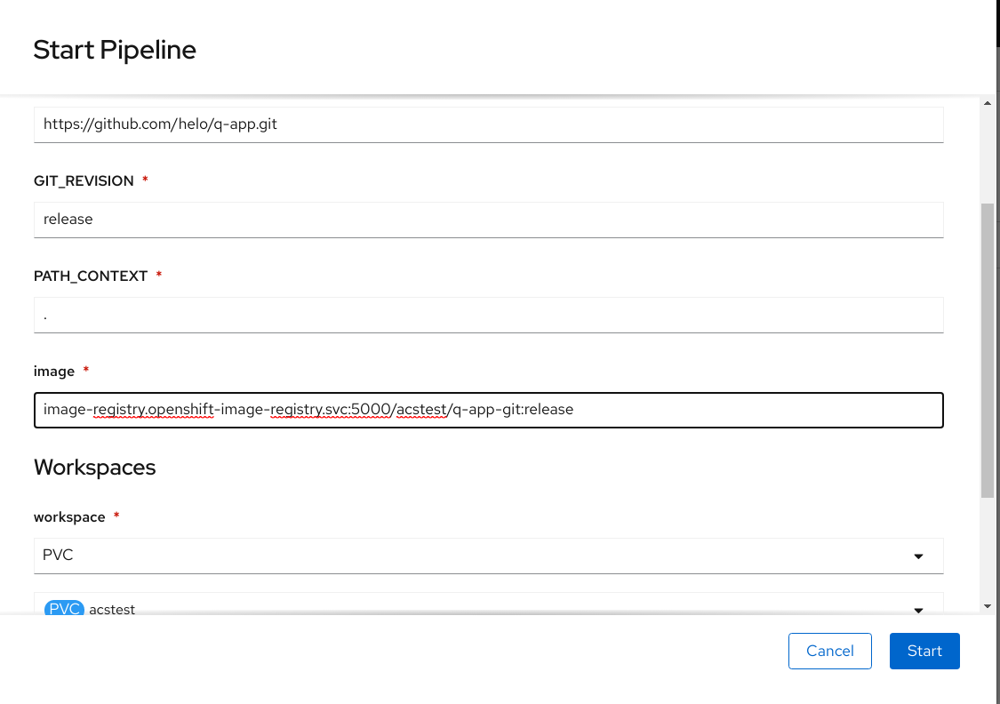

# Simple Tecton + RHACS demo



* Provision OCP4 ACS cluster from RHPDS
* Run below commands to setup the demo
```
git clone https://github.com/mglantz/rhacs-demo
cd rhacs-demo
oc create namespace acstest
oc new-app --name=q-app-git quay.io/quarkus/ubi-quarkus-native-s2i:20.1.0-java11~https://github.com/tqvarnst/q-app.git
oc create -f custom_image_check.json
oc create -f custom_image_scan.json
oc create -f acs_quarkus_policy.json
oc create -f pipeline_pv.json
oc get secrets roxsecrets -n stackrox-pipeline-demo -o yaml|grep -v resourceVersion|sed 's/stackrox-pipeline-demo/acstest/g' >roxsecrets.yaml
oc create -f roxsecrets.yaml
```

* Create ACS policy which will detect an issue in the built image via the RHACS web console.


* Runing a pipeline that fails:


* Running a pipeline that passes scanning


